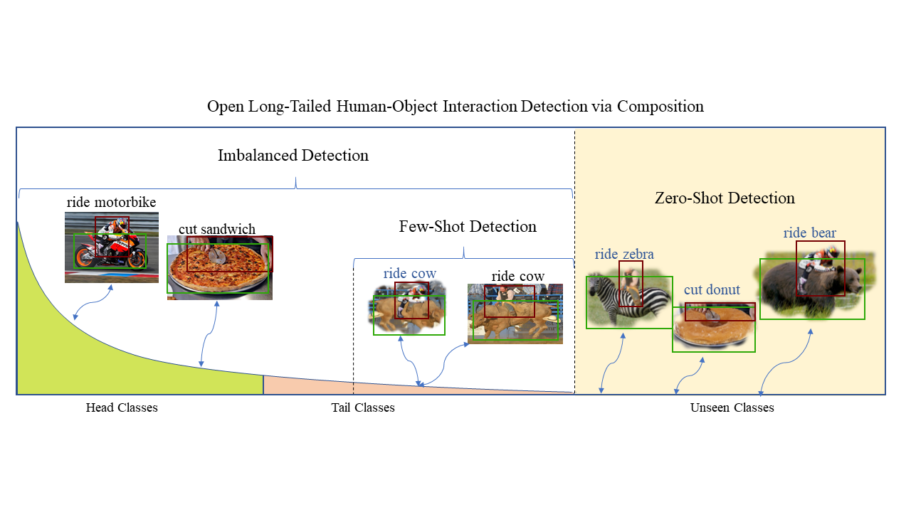

### Detecting Human-Object Interaction via Fabricated Compositional Learning (CVPR2021)
We propose a Fabricated Compositional Learning approach to address the Open Long-tailed HOI detection.



This repository is built from the code of previous approaches. Thanks for their excellent work.


In this repository, we have removed massive comments. Current code only contains zero-shot HOI detection and I have not tested this code. Full code is being constructed. 

***We have included VCL, FCL and our new work (ATL) in HOI-CL (https://github.com/zhihou7/HOI-CL).***

Here ([FCL_VCOCO](https://github.com/zhihou7/FCL_VCOCO)) is the Code for V-COCO 

Thanks for all reviewer's comments. Our new work, an extension of VCL, will be coming soon.

## Prerequisites

This codebase was developed and tested with Python3.7, Tensorflow 1.14.0, Matlab (for evaluation), CUDA 10.0 and Centos 7


## Installation

1. Download HICO-DET dataset. Setup V-COCO and COCO API. Setup HICO-DET evaluation code.
    ```Shell
    chmod +x ./misc/download_dataset.sh 
    ./misc/download_dataset.sh 
    ```

2. Install packages by pip.

    ```
    pip install -r requirements.txt
    ```
   
## Training
1. Download COCO pre-trained weights and training data
    ```Shell
    chmod +x ./misc/download_training_data.sh 
    ./misc/download_training_data.sh
    ```

3. Train Zero-Shot HOI model on HICO-DET
    ```Shell
    python tools/Train_FCL_HICO.py
    ```
    
### Test

we provide this scripts to test code and eval the results.

    ```Shell
    python scripts/eval.py
    ```

### Experiment Results


#### Long-tailed HOI detection
mAP on HICO-DET (Default)


|Model|Full|Rare|Non-Rare|
|:-|:-:|:-:|:-:|
|VCL|23.63 | 17.21 | 25.55 |
|FCL|24.68 | 20.03 | 26.07|
|VCL+FCL| 25.27| 20.57 |26.67|
|VCL^$GT$|43.09 | 32.56| 46.24|
|FCL^$GT$|44.26 | 35.46| 46.88|
|(VCL+FCL)^$GT$|45.25 | 36.27 | 47.94|

Here, VCL+FCL is the fusion of the two model predictions, which illustrates the complementary between the two lines of work. Table 12 in ATL also illustrates the differences between VCL and FCL. We also tried to directly train the network with the two methods. However, it is worse than the score fusion result.

#### Zero-Shot HOI detection

|Model|Unseen|Seen|Full|
|:-|:-:|:-:|:-:|
|VCL(rare first)|10.06 |24.28| 21.43|
|FCL(rare first)|13.16 |24.23| 22.01|
|VCL(non-rare first)|16.22|18.52|18.06|
|FCL(non-rare first)|18.66|19.55|19.37|

### Data & Model
#### Data
We present the differences between different detector in our paper and analyze the effect of object boxes on HOI detection. VCL detector and DRG detector can be download from the corresponding paper. 
Here, we provide the GT boxes.

GT boxes annotation: https://drive.google.com/file/d/15UXbsoverISJ9wNO-84uI4kQEbRjyRa8/view?usp=sharing

This work was finished about 10 months ago. In the first submission, we compare the difference among COCO detector, Fine-tuned Detector and GT boxes. We further find DRG object detector largely increases the baseline. 
All these comparisons illustrate the significant effect of object detector on HOI. That's really necessary to provide the performance of object detector.

#### Pretrained Model

Long-tailed Model: https://drive.google.com/file/d/144F7srsnVaXFa92dvsQtWm2Sm0b30jpi/view?usp=sharing

### Citations
If you find this submission is useful for you, please consider citing:

```
@inproceedings{hou2021fcl,
  title={Detecting Human-Object Interaction via Fabricated Compositional Learning},
  author={Hou, Zhi and Baosheng, Yu and Qiao, Yu and Peng, Xiaojiang and Tao, Dacheng},
  booktitle={CVPR},
  year={2021}
}
```

## Acknowledgement
Codes are built upon [Visual Compositional Learning for Human-Object Interaction Detection](https://arxiv.org/abs/2007.12407), [iCAN: Instance-Centric Attention Network 
for Human-Object Interaction Detection](https://arxiv.org/abs/1808.10437), [Transferable Interactiveness Network](https://arxiv.org/abs/1811.08264), [tf-faster-rcnn](https://github.com/endernewton/tf-faster-rcnn).
